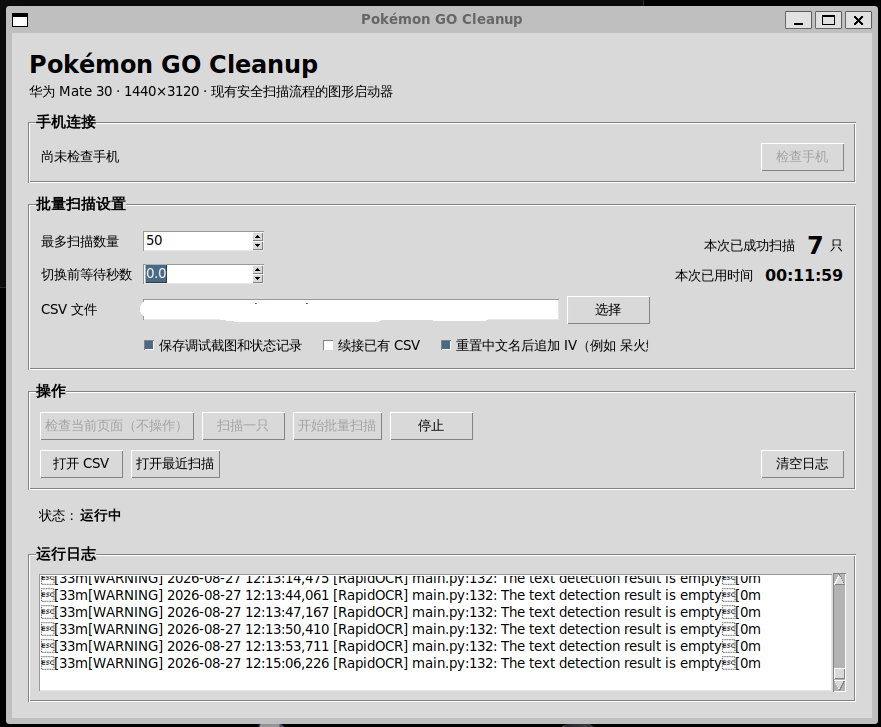

# pokemonGo_cleanUp

[English](README.md) | 简体中文

##目标：
用ADB截取安卓设备上的Pokémon GO每只宝可梦的详情页面与IV条，帮助整理现有宝可梦的CP，HP，技能，IV等。

## 快速开始

本项目目前推荐在 Windows 的 WSL Ubuntu 环境中运行。

打开 Ubuntu 终端，依次执行：

```bash
git clone https://github.com/S5-001481/pokemonGo_cleanUp.git
cd pokemonGo_cleanUp
bash scripts/setup-wsl.sh
```


安装成功后，终端会显示：

```text
安装完成。

Windows 桌面已经创建：
Pokémon GO Cleanup.bat
```
此后直接双击 Windows 桌面上的 `Pokémon GO Cleanup.bat` 启动图形界面。

## 界面示例



> [!IMPORTANT]
> OCR 和自动扫描并不是通用功能。目前只针对以下环境完成了校准：
> **Huawei Mate 30、1440 × 3120 分辨率、繁体中文 Pokémon GO 界面、
> WSL Ubuntu、Python 3.12，以及能够从 WSL 调用的 Windows
> `adb.exe`**。


## 兼容范围

| 功能 | 当前支持环境 |
| --- | --- |
| 设备查看与屏幕截图 | Windows 10/11、Python 3.12+、兼容 ADB 的 Android 或 HarmonyOS 设备 |
| 手动引导式扫描 | 与上项相同 |
| OCR 与 IV 识别 | Huawei Mate 30、1440 × 3120、繁体中文界面、WSL Ubuntu、Python 3.12 |
| 自动单只与批量扫描 | 与上项相同，并且 WSL 能调用 Windows `adb.exe` |

所需软硬件：
- Python 3.12 或更高版本；
- Android SDK Platform-Tools（包含 `adb`）；
- 支持数据传输的 USB 线；
- 已在手机上启用 USB 调试。

环境变量：
| 变量 | 用途 |
| --- | --- |
| `POKEMON_GO_CLEANUP_DATA_DIR` | 本地截图和扫描数据目录 |
| `POKEMON_GO_CLEANUP_ADB_PATH` | 明确指定 `adb` 或 `adb.exe` 路径 |
| `POKEMON_GO_CLEANUP_ADB_TIMEOUT_SECONDS` | ADB 命令超时秒数 |

## 本地数据目录

一组完整的手动或自动扫描结构如下：

```text
data/
└── scans/
    └── YYYY-MM-DD/
        └── <scan_id>/
            ├── summary.png
            ├── moves.png
            ├── appraisal.png
            ├── manifest.json
            ├── recognition.json   # 由识别命令创建
            ├── ground_truth.json  # 可选，由 annotate 创建
            └── debug/             # 可选，已被 Git 忽略
```

单次截图的 PNG 与同名 JSON sidecar 位于：

```text
data/screenshots/YYYY-MM-DD/
```

`manifest.json` 记录扫描进度与设备元数据；
`recognition.json` 保存机器识别值和 warning；
`ground_truth.json` 独立保存经过校验的人工输入值。

## 安全、隐私与功能边界
仓库不包含任何 Pokémon 图片、图标或截图。Pokémon 是其权利人的商标；本项目是
独立项目，与其权利人没有隶属或背书关系。

## 许可证
本项目采用 [Apache License 2.0](LICENSE)。
